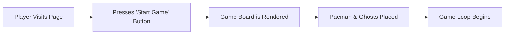
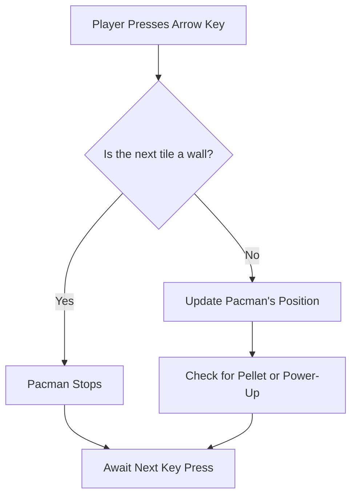
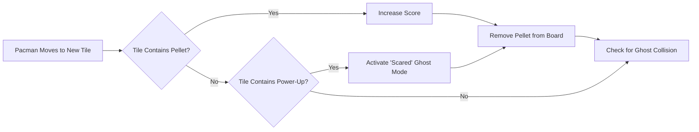
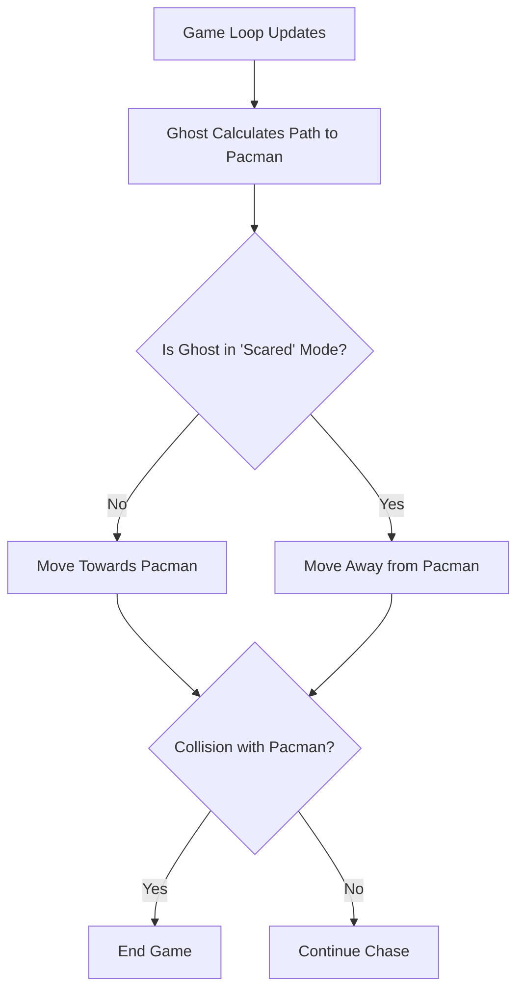

# 🎮 Pac-Man 3D - Next.js Edition

A modern 3D Pac-Man game built with **Next.js**, **Three.js**, and **React**. Experience the classic arcade game in stunning 3D graphics with responsive controls for both desktop and mobile devices.

## ✨ Features

- **3D Graphics**: Immersive 3D gameplay using Three.js
- **Responsive Design**: Optimized for desktop and mobile devices
- **Classic Gameplay**: Traditional Pac-Man mechanics with dots, pellets, and ghosts
- **Touch Controls**: Mobile-friendly WASD button controls
- **Score System**: Real-time score tracking
- **Lives System**: Classic 3-lives gameplay
- **Help Dialog**: In-game instructions for controls

## 🚀 Getting Started

### Prerequisites
- Node.js 18+ 
- npm, yarn, pnpm, or bun

### Installation

1. Clone the repository:
```bash
git clone <repository-url>
cd pacman-nextjs
```

2. Install dependencies:
```bash
npm install
# or
yarn install
# or
pnpm install
```

3. Run the development server:
```bash
npm run dev
# or
yarn dev
# or
pnpm dev
```

4. Open [http://localhost:3000](http://localhost:3000) in your browser

## 🎯 How to Play

### Desktop Controls
- **W** - Move Up
- **A** - Move Left  
- **S** - Move Down
- **D** - Move Right

### Mobile Controls
- Tap the **W/A/S/D** buttons on screen
- Use the **HELP** button for control instructions

### Objective
- Navigate Pac-Man through the maze
- Collect all dots and pellets
- Avoid the ghosts
- Survive with your 3 lives

## 🛠️ Technology Stack

- **Framework**: Next.js 14+ (App Router)
- **3D Graphics**: Three.js
- **Styling**: CSS3 with responsive design
- **Font**: Helvetiker (Three.js font)
- **Audio**: Web Audio API (for sound effects)

## 📁 Project Structure

```
pacman-nextjs/
├── src/
│   └── app/
│       ├── layout.js          # Root layout
│       ├── page.js            # Main game component
│       ├── globals.css        # Global styles
│       └── pacman.css         # Game-specific styles
├── public/
│   ├── js/
│   │   ├── three.js           # Three.js library
│   │   ├── game.js            # Main game logic
│   │   └── helvetiker_regular.typeface.js
│   ├── css/
│   │   └── style.css          # Original game styles
│   ├── sounds/                # Game audio files
│   └── assets/                # Game assets
└── package.json
```

## 🎨 Features in Detail

### 3D Rendering
- Real-time 3D maze rendering
- Dynamic camera positioning
- Smooth character animations
- Particle effects for dots/pellets

### Responsive Design
- **Desktop**: Full-screen gameplay with keyboard controls
- **Mobile**: 75/25 screen split (game/controls)
- Adaptive UI elements based on screen size

### Game Mechanics
- Classic Pac-Man AI for ghost behavior
- Collision detection system
- Power pellet mechanics
- Score multipliers and bonuses

## 🚀 Deployment

### Vercel (Recommended)
```bash
npm run build
# Deploy to Vercel
```

### Other Platforms
```bash
npm run build
npm start
```

# ⚙️ How It Works
The game's logic is broken down into several key flows, from starting the game to the AI that drives the ghosts.
## 1. Game Start Flow
The game initializes when the player lands on the page and decides to start.


## 2. Player Movement
Player movement is handled by listening for keyboard events and checking for valid moves.


## 3. Core Game Logic
The game state is updated based on Pacman's interactions with pellets, power-ups, and ghosts.


## 4. Ghost AI Behavior
Each ghost follows a simple AI pattern to chase the player, which changes when a power-up is active.


## 🗄️ Local backend for scores (added)

This project includes a simple file-based backend (Next.js App Router API routes) to store users and scores in `data/users.json`.

- POST `/api/users` { username } -> creates/ensures a user exists
- POST `/api/scores` { username, score } -> submits a score (updates highScore)
- GET `/api/scores?username=NAME` -> fetch user and highScore

The APIs are file-backed (stored in `data/users.json`) and intended for local development only. For production use, replace with a real database.

### File vs Neon DB (or any hosted DB)

- File (current approach): simple, zero-deploy, great for demos and very small traffic. Downsides: not safe for concurrent writes, not scalable, and not shared across multiple instances.
- Neon / Postgres / Hosted DB: recommended for production. Provides concurrency, durability, and scaling. If you expect many concurrent players or want a persistent leaderboard across deployments, use a hosted DB.

Estimated capacity: the file approach can handle a small number of users (hundreds to low thousands) only if traffic is light and you're running a single server instance. For anything larger or multi-instance deployments, migrate to a proper DB.


📦 Getting Started Locally

## 🤝 Contributing

1. Fork the repository
2. Create a feature branch
3. Make your changes
4. Test thoroughly
5. Submit a pull request

## 📄 License

This project is open source and available under the [MIT License](LICENSE).

## 🎮 Credits

- Original Pac-Man concept by Namco
- Three.js for 3D graphics
- Next.js for the React framework
- Font: Helvetiker Regular

---

**Enjoy playing Pac-Man 3D!** 🟡👻
